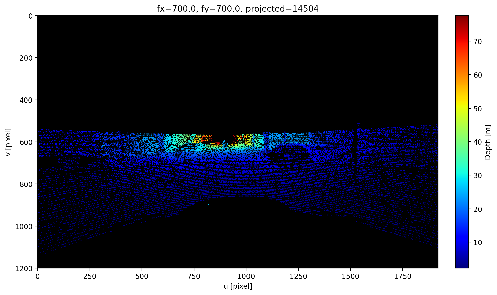
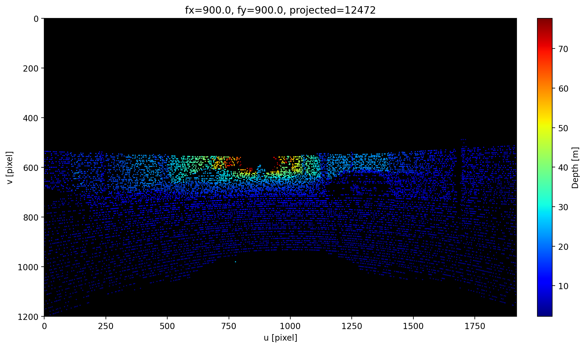
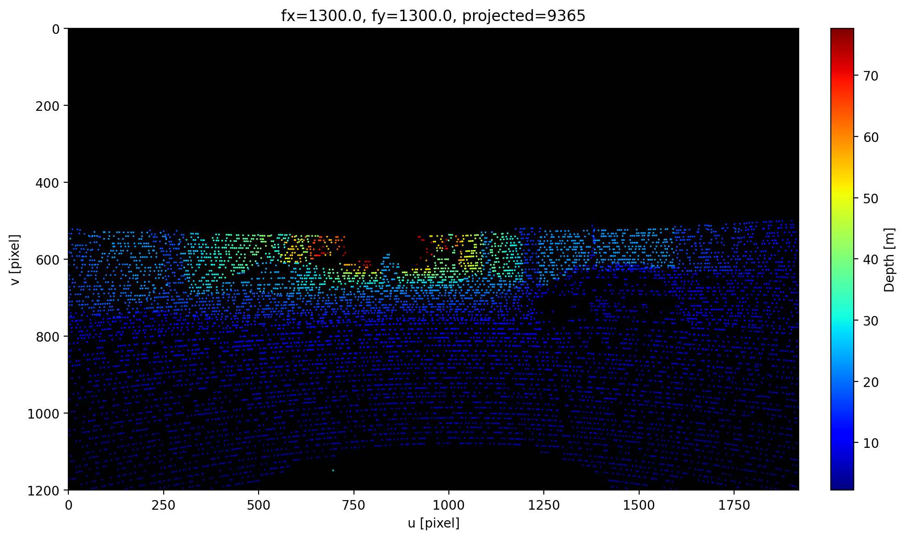
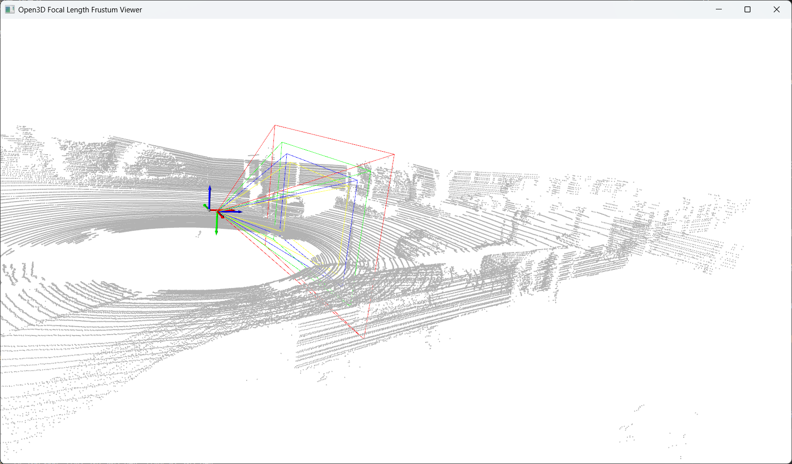

# Pointcloud Projection Simulator

This project transforms LiDAR point clouds into the camera coordinate frame, compares 2D projections for multiple focal lengths, and visualizes camera frustums in 3D with Open3D.

## Key Features

- Compare projection results for multiple `fx`, `fy` combinations in one run
- Overlay projected points on an image background (optional)
- Visualize 3D frustums and point clouds with Open3D
- Support `npy`, `kitti_bin`, and `pcd` point cloud formats
- Support YAML and JSON config files for projection/frustum scripts
- Estimate initial OpenCV camera intrinsics from camera/lens datasheet specs

## Project Structure

```text
data/
  images/
  pcd/
doc/
outputs/
scripts/
  create_camera_matrix.py
  fov_compare.py
  projection_compare.py
camera_config.yaml
projection_config.yaml
```

## Requirements

- Python 3.10 or newer recommended
- NumPy
- OpenCV (`opencv-python`)
- Matplotlib
- Open3D
- PyYAML

### Install Example

```bash
pip install numpy opencv-python matplotlib open3d pyyaml
```

## Quick Start

### 1. (Optional) Generate initial camera intrinsics from datasheet values

Use `camera_config.yaml` as input and generate OpenCV-style JSON.

```bash
python scripts/create_camera_matrix.py --config camera_config.yaml
```

If `output.save_opencv_json` exists in `camera_config.yaml`, JSON is saved automatically.
You can also override output path:

```bash
python scripts/create_camera_matrix.py --config camera_config.yaml --save-json outputs/camera_intrinsics.json
```

### 2. Run 2D projection focal-length comparison

```bash
python scripts/projection.py --config projection_config.yaml
```

If `experiment.save_path` is a file path, the script creates a folder with the same stem and saves one image per focal length. For example, `./outputs/focal_experiment.png` produces images under `./outputs/focal_experiment/`.

### 3. Run 3D frustum comparison

```bash
python scripts/fov_compare.py --config projection_config.yaml
```

## Configuration Files

This repository uses two main config files.

### `projection_config.yaml`

Used by `projection.py` and `fov_compare.py`.

#### `io`

- `points_path`: input point cloud file path
- `points_format`: one of `npy`, `kitti_bin`, `pcd`
- `image_path`: background image path

#### `camera`

- `width`, `height`: image resolution
- `cx`, `cy`: principal point
- `dist_coeffs`: OpenCV distortion coefficients (default 5 values)

#### `experiment`

- `fx_list`: focal lengths to compare
- `fy_list`: optional list for `fy`; if omitted, `fx_list` is reused
- `min_depth`: minimum depth threshold for projection
- `max_points`: maximum number of points to use
- `point_size`: rendered point size
- `save_path`: output path
- `use_image_background`: whether to use image background

#### `transform`

- `T_cam_lidar`: 4x4 transform from LiDAR frame to camera frame
- or `R` (3x3) + `t` (3,)

#### `open3d`

- `point_size`: Open3D point size
- `frustum_depth`: frustum depth
- `show_coordinate_frame`, `coordinate_frame_size`
- `show_camera_frame`, `camera_frame_size`
- `add_camera_centers`, `camera_center_radius`
- `background_color`: `[r, g, b]`

### `camera_config.yaml`

Used by `create_camera_matrix.py`.

#### `camera`

- Camera model and resolution
- Either `pixel_size_um` or `sensor_size_mm`

#### `lens`

- Lens model and focal length (`focal_length_mm`)
- Optional nominal FOV/spec fields from datasheet

#### `estimator`

- `principal_point_mode`: `pixel_center` or `image_center`
- `distortion_coeff_count`: number of placeholder distortion coefficients

#### `output`

- `save_opencv_json`: output JSON path

## Recommended Workflow

1. Fill `camera_config.yaml` with your camera/lens datasheet values.
2. Run `create_camera_matrix.py` to get initial `fx`, `fy`, `cx`, `cy`, and placeholder distortion.
3. Copy/adapt those values into `projection_config.yaml` (`camera` and `experiment` sections).
4. Run `projection.py` and `fov_compare.py` for qualitative validation.
5. Refine values with real calibration data if needed.

## Data Formats

### `npy`

- shape: `[N, >=3]`
- first three columns are used as `x, y, z`

### `kitti_bin`

- KITTI-style `float32` binary
- loaded as `N x 4`; only first three columns are used

### `pcd`

- `.pcd` files readable by Open3D

## Transform Convention

This project uses `T_cam_lidar`.

```text
p_cam = T_cam_lidar * p_lidar
```

In `fov_compare.py`, the inverse transform is used internally to place frustums in the LiDAR frame.

## Example Results

### 2D Projection Results

The images below show projections of the same point cloud with different focal lengths.






### 3D Frustum Comparison

Example view of camera frustums and a point cloud in Open3D.



## Troubleshooting

- If `PyYAML` is missing, install with `pip install pyyaml`.
- If `.pcd` loading fails, verify Open3D installation and file paths.
- If projection results are empty, check `T_cam_lidar`, `min_depth`, and coordinate frame consistency.
- If camera estimation looks off, verify units (`mm` vs `um`) in `camera_config.yaml`.

## License

If no license file is included in this repository, confirm redistribution and reuse terms with the project owner before use.